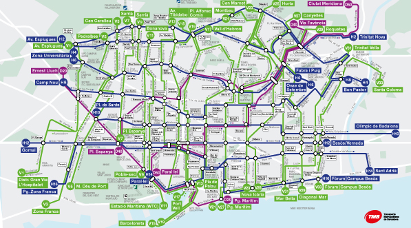

# Midterm-project



Author: Gonzalo España-Heredia Llanza

<p align="left">  </p> This repo contains all code needed to replicate my personal mid-term project from the [CORECODE](https://www.corecode.school/bootcamp/bdml) Big Data & ML bootcamp.

The repo has 3 main parts:
- [Data cleaning](https://github.com/gehll/Midterm-project/tree/main/clean_data)
- [API](https://github.com/gehll/Midterm-project/tree/main/api)
- [Streamlit app](https://github.com/gehll/Midterm-project/tree/main/streamlit)

## Launch the project locally

**Important aspects**

If you go to `streamlit/data_st/get_data.py` you will find the functions that are used to call the API and get the data for the streamlit app. If you look closely, all functions have as URL the URL of the Heroku app created for the API. Leave this if you are going to connect to the API on the cloud, but if you want to launch the project locally and make changes, you must change the URL to your <localhost>:<desired_host>

To launch the project locally, from the cli in the path of the repository:

First, **launch the API**:

```bash
cd api
./run_api-develop.sh
```

Then, **laucnh the streamlit app**

```bash
cd streamlit
./run_streamlit-develop.sh
```

 
## Data cleaning

The data used can be found in [kaggle](https://www.kaggle.com/datasets/xvivancos/barcelona-data-sets) on a dataset with data about the city of Barcelona. For this project only two files are needed: transports.csv and bus_stops.csv.

**transports.csv** contains data about different types of public transports (subway, railway, cableway, tramvia, etc) and **bus_stops.csv** contains data about the different types of bus stations (day bus, night bus, airport bus, bus stations). 

During the cleaning, the goal was to concatenate both datasets so it was necessary to rename columns, have a consistent format across both datasets, clean data, create new columns and transform the columns with the coordinates to one single column with *Point* format and 2D-index for spatial queries. To access the data through the API, the data was stored in Mongodb Atlas, mainly because the goal was to make geoqueries later on the streamlit. Thus it is better to work with mongo than with a relational database. After the data was cleaned, a blank collection was filled with the clean data, this collection is called **geo_transports**.
  
 Inside the `data`folder you can find 3 `.csv` files. Two are the ones we mentioned, the other one is the resulting dataset from cleaning and concatenating the data. This dataset is later used to fill the blank collection *geo_transports* and work with data in geoJSON format. You can find all the cleaning process [here](https://github.com/gehll/Midterm-project/blob/main/clean_data/clean.ipynb).

## API

The API is used as the connection between Mongodb Atlas and the streamlit app. There are several endpoints to access the data in the collection (geo_transports). All the endpoints can be found at `api/routers/endpoints.py` [here](https://github.com/gehll/Midterm-project/blob/BACKUP/api/Routers/endpoints.py).


#### API Reference

##### Get all items from a collection

```http
  GET /url/collection/{name}
```

| Parameter | Type     | Description                |
| :-------- | :------- | :------------------------- |
| `name` | `string` | **Required**.|

##### Get a specific transport type

```http
  GET /url/transport_type/{type}
```

| Parameter | Type     | Description                       |
| :-------- | :------- | :-------------------------------- |
| `type`      | `string` | **Required**. |

##### Get a sample from a specific transport type

```http
  GET /url/sample/{type}/?{limit}&{rawData}
```

| Parameter | Type     | Description                       |
| :-------- | :------- | :-------------------------------- |
| `sample`      | `string` | **Required**. |
| `limit`      | `int` | **Optional**. Default=0. Takes all values |
| `rawData`      | `int` | **Optional**. Default=1. Whether to sample for *Bus* or not |


##### Make geoquery

```http
  GET /url/geoquery/?{type}&{location}&{lines}
```

| Parameter | Type     | Description                       |
| :-------- | :------- | :-------------------------------- |
| `type`      | `string` | **Required**. The type of transport|
| `location`      | `list` | **Required**. Location in coordinates|
| `lines`      | `list` | **Required**. The desired lines|


## Streamlit

The streamlit app consists of two main parts:
- Overview
- Query map

#### Overview

At the beginning of the streamlit, you can see a map of the city of Barcelon with different markers that display station of all the transport types in the data. This maps shows only a sample of all stations. Also, before the map, you can find a sample of the data by clicking on a checkbox.

#### Query map

The next and last part is a map that shows the closests transport stations based on a query. The query asks you to enter some coordinates, the types of transport you would like to filter (maximum 2 types) and the desired lines from those types of transport. When filtering for the lines, the list can be quite long, especially if you select *Bus*. The reason of showing a list and choosing from the list instead of asking for the desired lines with text input, is because I suppose that most of the people don't know the names of the lines for each type of transport in Barcelona.

After introducing the query parameters, a geoquery is made to display a map with the closest stations where your desired lines pass through. You will get the 5 closest stationf for each type of transports that you select.


## API and Streamlit app in Heroku

If you look inside `api` and `streamlit` folders, you will see that there is a `Dockerfile` and a `deploy.sh` in each folder. Both the API and the streamlit app have been developed an tested locally but they can be accessed in the cloud. Both haven been deployed in Heroku with a Docker image.

- To access the API on the cloud: [https://core-midterm.herokuapp.com/](https://core-midterm.herokuapp.com/)
- To access the streamlit app on the cloud: [https://core-midterm-streamlit.herokuapp.com/](https://core-midterm-streamlit.herokuapp.com/)


### Deployment

To deploy this project first you need to deploy the API so that the streamlit can feed from it.

You must:
- Have Docker downloaded 
- Have the Heroku cli 
- In your Heroku account, create a new app. This will be the app to place to deploy the image.

**Build** the image:

```bash
cd api
docker build -t api .
```

After building the image, deploy it on Heroku:

```bash
./deploy.sh
```

Go to your Heroku app. The deployment should be successful and you should be able to launch the app.

Once we have the API on the cloud, it is time to deploy the streamlit app. The process is pretty much the same.

Go back to the root of the repo

```bash
cd streamlit
docker build -t st .
```

After building the image, deploy it on Heroku:

```bash
./deploy.sh
```

**It is important that you change the URL to on the functions that will feed the streamlit app with data.**
**To run the project locally, just put you localhost and desired port on the URL. To connect with the API on the cloud, you must put the URL to the Heroku app you just created.**

